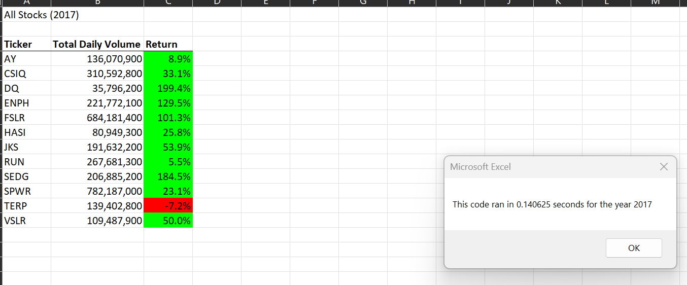
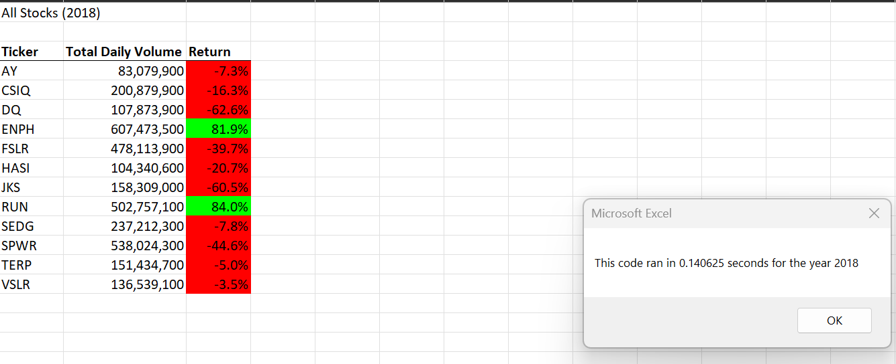
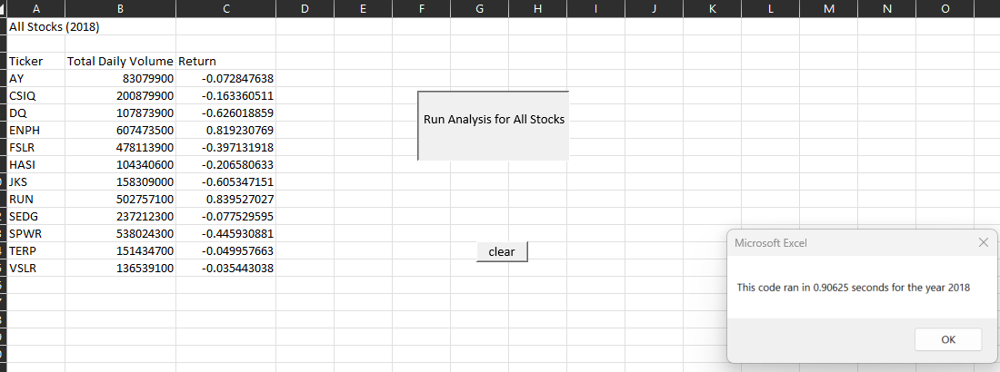

# Stock Analysis 

## Overview of Project

The purpose of our project was originally to see what were the best green stocks to possibly invest in
for our friend Steve and his parents. We were given a data set of two years worth of stock data and
wanted to go through it to see what may be the best option for investing in green energy.  

## Results

As we said, we have two years worth of stock data from 2017 and 2018.  Originally Steve wanted us
to check on a stock called DAQO (ticker DQ) to see how well that had done over the last two years since this
is what his parents were interest in.  We first checked 2017 and when we review that we see that it was a very
good year for DQ in 2017 and in fact, it was a very good year overall for the green companies we were reviewing.

When we then review 2018 things though did change a bit for our green companies.  As we can see below DQ
was down almost 63% for the year and not just them but 10 of our 12 green comapanies all had a lower 
return in 2018.  The big issue with DQ was that they had the worst of all of the green companies in
return investment.

### Analysis of Code

Our orignal code that we used during the module is slower than our refactored one we created last.
as the two images above show the run time for each was under .2 seconds for it to calculate our code.
The original code takes .90 to do the same analysis as our refactored code.  It basically almost takes
a full second to give us results!  That may not seem like a long time but since our new code is so
much quicker and efficient we needed to update that. 

## Summary

### Advantages and Disadvatages of refactoring code

- Advantage:  The code that was refactored was much more efficient than our orignal code as stated and
- shown above.  That isnt a big deal in our data set becaue it wasn't that much data but if we had
- to pull in more data more stocks than our original code would most likely take much to long to 
- run and possible cause some computer issues in general. 

* Disadvantage:  Time for us.  THe original code does work but it also works slower.  Again, this may
* have been great for this one time we helped out our friend but if we had to do more and chances
* are that we would, refactoring the code may take some extra time but it's the best way to go.

### Pros and Cons

+ Pros:  this code that we refactored can be used in the future for more data without maybe having to
+ refactor it.  Of course perhaps a bigger data set may mean that we have to refactor again but at
+ least we are off to a good start.  It was also easy to read and when you add buttons it is user 
+ friendly so our client (Steve and his parents) can easily use it and understand exactly what is 
+ going on with the data output.

- Cons:  honestly there are no real Cons here unless you think about your time as a coder.  And again
- this was done in such a way that it's very possible Steve comes back to us and asks us to review more
- data for him as his clients could increase from not just his parents but anyone.  

